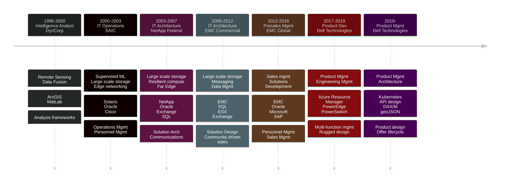

## About
Blog posts, tools and projects that make my day to day work more efficient, consistent, and repeatable.  I sometimes roll out proofs of concept and demos to cloudmappr.com.  Reach out if you'd like to collaborate.

### My experience

