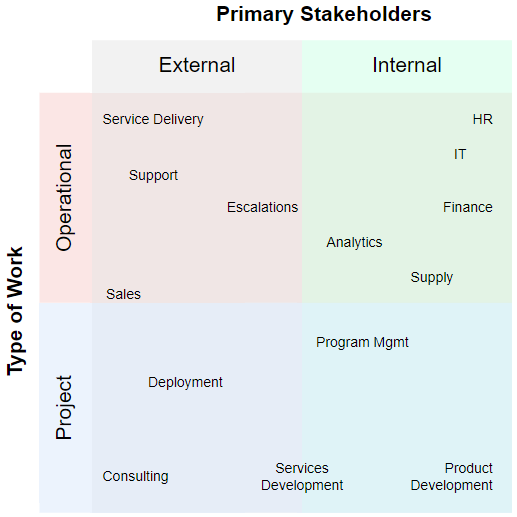

# develop organizational awareness
## purpose
Knowledge worker roles are relatively fluid, requiring some level of cross-domain communication and expertise.  This exercise creates a skills matrix and social network specific to your current or desired role.

## exercises

1. Using the quadrant chart and your organization's chart as prompts, approximate the firm's value chain using a [directed graph](https://en.wikipedia.org/wiki/Directed_graph) network
2. Show allocated personnel densities by function
3. Rate your academic understanding of each function
4. Rate your organizational awareness of each function
5. Rate the frequency with which you interact with each function
6. Apply your [RACI role](https://en.wikipedia.org/wiki/Responsibility_assignment_matrix) to each function, leaving functions where you are not informed blank.
7. Develop a learning plan to get you to 
   1. 100 level on all functions on the network - to be effective with a broad array of stakeholders, you need to be able to express and interpret actionable business needs succinctly and efficiently
   2. 400 level on all functions directly connecting to yours - to be relevant to your business, you need to be able to contribute meaningfully to the discourse surrounding adjacent business functions
   3. 500 level on your function - to claim status as a knowledge worker, you must operate at the post-graduate level in your domain.