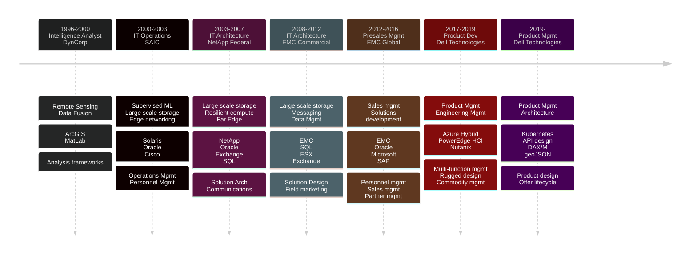

------------------
[Paul Galjan](mailto:galjan@gmail.com)                      
-------------------
### Summary
Technologist with proven experience managing the IT lifecycle across a broad set of domains and applications.  Applies robust analytical approaches to develop strategic consensus for executable technical roadmaps for products and solutions ranging from late-research to mid-development stages and across market scale points.
#### Career Path

### Experience
#####  2017 - current | Product Management | Dell Technologies 
> - Developed observability, business logic, GIS, and serviceability strategies for NativeEdge Orchestrator
> - Overhauled deployment experience for HCI product, enabling self-service onboarding across a product with >$2B ARR
> Introduced first net new product line in the combined Dell/EMC entity, attaining #1 volume and margin share owner in the space with over $100M revenue
> Developed key differentiators 
> 
#####  2012 - 2016 | Presales Leadership | EMC
> Introduced first net new product line in the combined Dell/EMC entity, attaining #1 volume and margin share owner in the space
> First product in combined Dell/EMC entity to deliver a fully calendar based release schedule
> 

