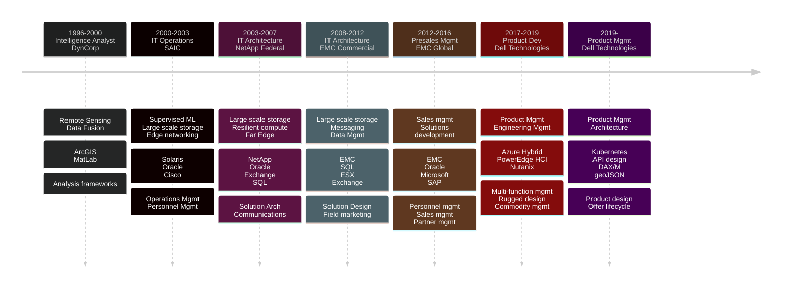

------------------
[Paul Galjan](mailto:galjan@gmail.com)                      
-------------------
### Summary
Technologist with proven experience managing the IT lifecycle across a broad set of domains and applications.  Applies robust analytical approaches to develop strategic consensus for executable technical roadmaps for products and solutions ranging from late-research to mid-development stages and across market scale points.
#### Career Path

### Experience
#####  2017 - current | Product Management | Dell Technologies 
> - Developed observability, business logic, GIS, and serviceability strategies for [NativeEdge Orchestrator](https://infohub.delltechnologies.com/en-us/l/introduction-to-the-dell-nativeedge-software-platform-white-paper-3/nativeedge-orchestrator-5/)
> - Overhauled [deployment experience](https://vxrailconfiguration.dell.com/getStarted) and enabled self-service onboarding across a product with >$2B ARR
> - Responsible for the introduction first [net new product line](https://www.dell.com/en-us/dt/hyperconverged-infrastructure/microsoft-azure-stack/microsoft-azure-stack-hub.htm#tab0=0) in the combined Dell/EMC entity, attaining #1 volume and margin share owner in the space with over $100M revenue

#####  2012 - 2016 | Presales Leadership | EMC
> - Recruited and managed global team of highly specialized technologists in the areas of high-volume data platforms, ERP, CRP, and enterprise communications
> - Developed business and use cases for solutions and product development

#####  2007 - 2012 | Presales Engineering | EMC
> - Architected data platforms for joined EMC and Microsoft customers, supporting over $50m in annual sales, delivering proofs of concept and presales engineering consultation
> - Developed tool to automate collection of data-intensive application topology and performance data used across 1000s of customers

#####  2004 - 2007 | Presales Engineering | NetApp
> - Led technical sales efforts and proofs of concept for large opportunities across NetApp Federal
> - Designed NetApp storage architectures to address [DISA ESS2](https://www.wwt.com/press-release/wwt-awarded-disa-enterprise-storage-services-ii-contract) contract, among many others
> - Developed tool to automate collection of data-intensive application topology and performance data used across 1000s of customers

#####  2000 - 2003 | IT Operations | SAIC
> - DevOps/infrastructure lead for supervised machine learning on open source [MASINT data](https://apps.dtic.mil/sti/tr/pdf/ADP204402.pdf)
> - Improved data center availability 20x over 18 months, reducing capital and operational expeditures 4x

#####  1996 - 2000 | Intelligence Analyst | DynCorp
> - Provided decision support and course-of-action analysis for DoD backstopping during the negotiation and implementation of the Comprehensive Nuclear-Test-Ban Treaty [verification regime](https://www.ctbto.org/our-work/verification-regime)
> - Developed protocols, processes and systems to monitor sensor availability for the [International Monitoring System](https://www.ctbto.org/our-work/ims-map)

